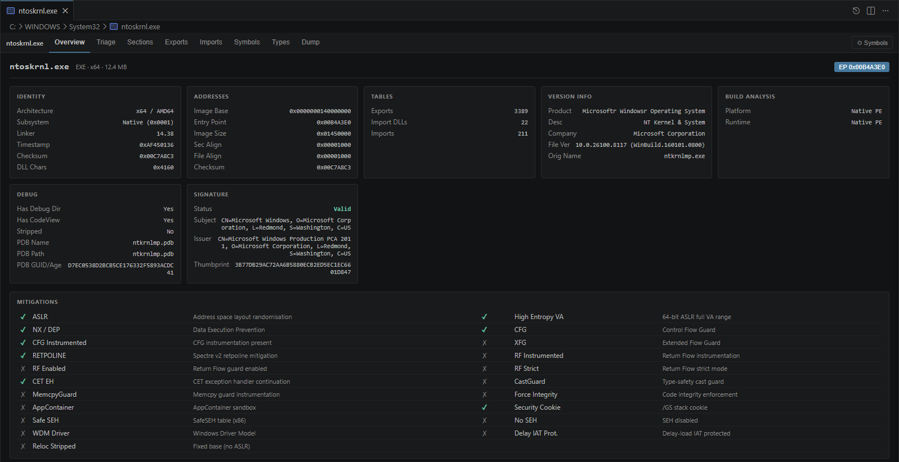
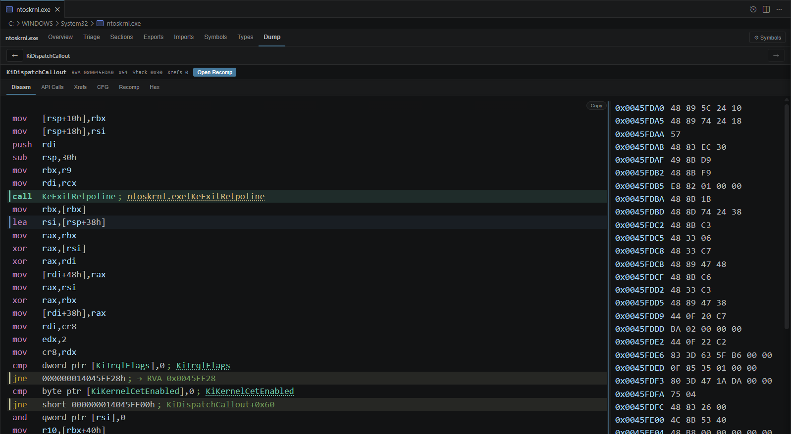
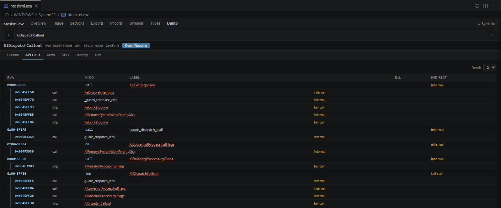
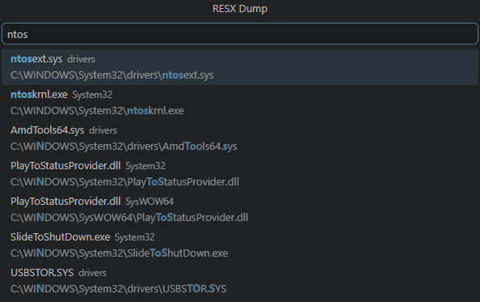
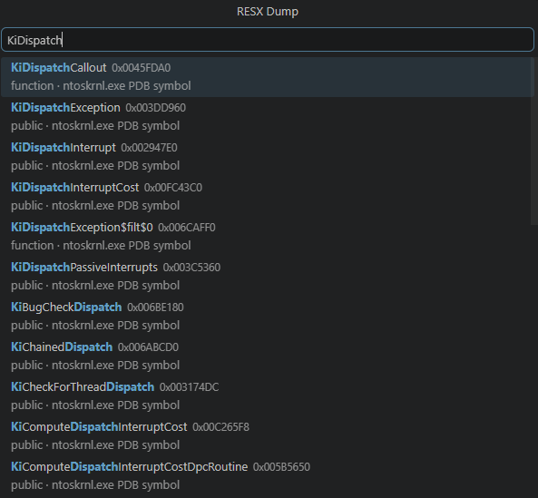

<h1 align="center">RESX</h1>
<p align="center"><b>Windows Binary Analysis & Reverse Engineering Toolkit</b></p>

<p align="center">
  
  
  
</p>

**RESX** is a Windows SRE and binary-analysis utility designed to make reverse engineers' and malware analysts' lives easier. **RESX** does not try to replace a fully fledged disassembler such as [IDA](https://hex-rays.com/ida-pro), [Ghidra](https://github.com/nationalsecurityagency/ghidra), or [Binary Ninja](https://binary.ninja/). It provides quick PE inspection, deep function discovery and tracing, Windows API origin and syscall analysis, reverse engineering workflows, structural binary comparison, kernel-driver analysis, IOCTL recovery, intelligence, and more.

## Documentation

- [Full changelog](CHANGELOG.md)
- [Command reference](COMMANDS.md)
- [CLI documentation](docs/cli.md)
- [VS Code extension documentation](docs/vscode-extension.md)
- [DLL / FFI integration](docs/dll.md)
- [Analysis surfaces](docs/analysis-surfaces.md)
- [JSON schemas](docs/json-schemas.md)
- [Security policy](SECURITY.md)

## Features

- Hardened PE32+ metadata, section, data-directory, debug, CLR, TLS, load-configuration, certificate, version, and anomaly inspection.
- Export Address Table and Import Address Table browsing.
- Export and PDB symbol loading, type browsing, and symbol-backed navigation.
- Targeted disassembly by name, RVA, VA, file offset, or ordinal.
- Reachable multi-stream decoding for overlapping x86/x64 instruction streams.
- Lowercase Intel-style disassembly with stack-frame aliases and optional lightweight SSA annotations through `--ssa`.
- Bounded Win64 ABI prototype recovery for register, stack, integer, floating-point, pointer, and return-value evidence.
- Incoming call and jump xrefs for functions and imports.
- C-like reconstruction and bounded CFG rendering for selected functions.
- Startup-flow reconstruction from entry points, TLS callbacks, thread and work-pool callbacks, import calls, indirect edges, and x64 unwind or exception-handler evidence.
- Static triage with hook and thunk indicators, string references, API-call maps, suspicious control-flow hints, and explicit decode-conflict records.
- Static behavior triage for syscall stubs, anti-analysis instructions, TLS callbacks, loader APIs, executable-memory setup, IPC, networking, and cryptography.
- Protected-file triage for packer markers, OEP handoff candidates, import-rebuild leads, VM dispatcher or handler candidates, and bounded payload recovery.
- Terminal entropy maps over executable code with ASCII, zero-byte, unique-byte, and high or low entropy flags.
- Hostile-mode tracing for packed or deliberately confusing binaries.
- Reverse caller tracing across priority modules and custom scan scopes.
- Structural diffing, CFG diff views, code and control heatmaps, corpus indexing, and sample hunting.
- Kernel-driver, WDF, NDIS, and hypervisor-oriented analysis with IOCTL and dispatch recovery.
- Guarded byte patching by RVA, VA, or file offset.
- Folder scanning with fuzz-target candidate ranking.
- YARA-compatible scanning and bounded string, byte-pattern, instruction, and symbol search.
- Versioned JSON output for automation.
- Native C ABI and VS Code binary viewer.

RESX operates on file bytes and optional symbol data. It does not load or execute the analyzed image.

## Build The CLI

```powershell
cargo build --release
```

Run:

```powershell
.\target\release\resx.exe help
.\target\release\resx.exe version
```

Common commands:

```powershell
resx dump <image> <function>
resx dump <image> --at <address>
resx xrefs <image> <function-or-import>
resx cfg <image> <function>
resx reconstruct-cfg <image>
resx intelli <image> [function]
resx behavior <image>
resx contracts <image>
resx driver <image>
resx ioctl <image>
resx ipc <image>
resx network <image>
resx crypto <image>
resx payload <image>
resx entropy <image>
resx patch <image> --at <address> --patch-bytes <hex>
resx peinfo <image>
resx pechk <image>
resx sections <image>
resx eat <image>
resx iat <image>
resx syms <image>
resx types <image> [query]
resx strings <image>
resx callers <image> <function>
resx locate <name>
resx locate-sym <name>
resx find <image> <query>
resx scan <path>
resx diff <old-image> <new-image>
resx index <dir-or-image> --db <file>
resx hunt <sample> --db <file>
resx yara <image> <rule.yar>
```

See [docs/cli.md](docs/cli.md) for the full command and option reference.

## Install The VS Code Extension

```powershell
cd resx-vscode
npm ci
npm run compile
npm run package
```

Install the generated `.vsix` with:

```text
Extensions: Install from VSIX...
```

The extension contributes a custom editor for Windows binaries and command-palette workflows:

- `RESX: Open Binary File`
- `RESX: Refresh Binary Analysis`
- `RESX: Locate`
- `RESX: Locate Symbol`
- `RESX: Dump`
- `RESX: Reconstruct CFG`
- `RESX: Scan Folder`

The viewer includes Overview, Entry, Triage, Sections, Exports, Imports, Symbols, Types, Flow, Scan, Dump, and Dev tabs.

See [docs/vscode-extension.md](docs/vscode-extension.md) for build, packaging, settings, trust model, and workflow details.

## Use The DLL / FFI

Build the DLL:

```powershell
cargo build -p resx --release
```

Use the public header:

```text
resx/include/resx.h
```

Example C call:

```c
#include "resx.h"

char *json = NULL;
int status = RsxPeInfo(
    "C:\\Windows\\System32\\kernel32.dll",
    "{\"no_pdb\":true}",
    &json
);

if (json) {
    /* parse or print json */
    RsxFreeString(json);
}
```

See [docs/dll.md](docs/dll.md) for exported functions, status codes, option JSON, output envelopes, memory ownership, and smoke-test instructions.

## Screenshots

### VS Code Binary Viewer








### Command Palette Workflows






## JSON Automation

Use `--json` for machine-readable output:

```powershell
resx peinfo .\sample.dll --json
resx behavior .\sample.dll --json
resx contracts .\sample.dll --json
resx driver .\sample.sys --json
resx payload .\sample.dll --json
resx entropy .\sample.dll --json
resx dump .\sample.dll DllMain --json
resx reconstruct-cfg .\sample.dll --json
resx scan .\samples --json
resx diff .\old.dll .\new.dll --json
```

Where possible, RESX emits versioned JSON envelopes. Consumers should tolerate additional fields across releases.

## License

RESX is available under the [MIT License](LICENSE). You may use, modify, and distribute it provided the RYFTENIUS copyright and license notice are retained.
